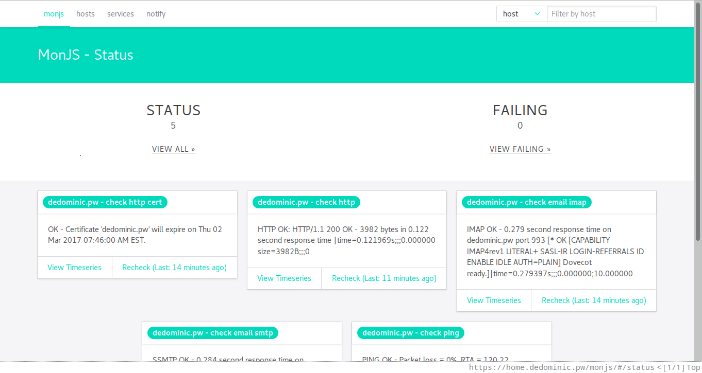
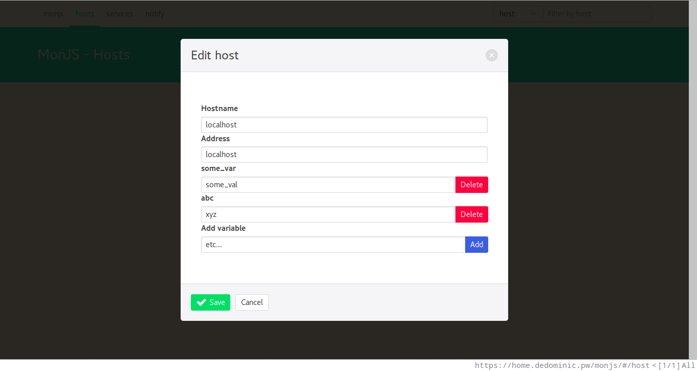
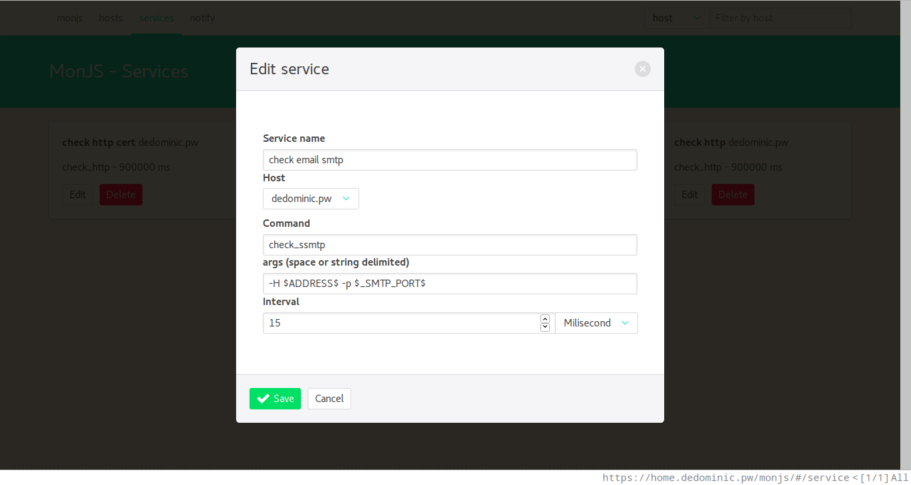
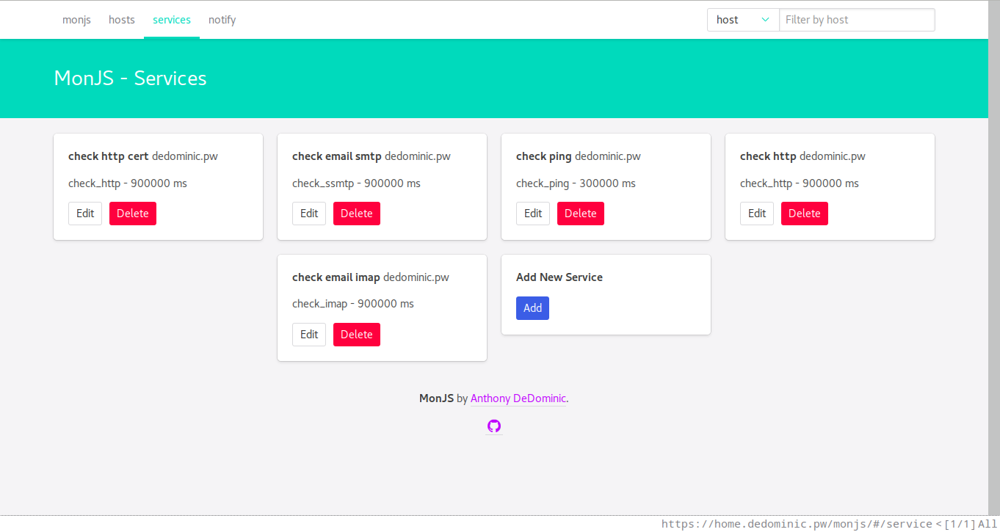
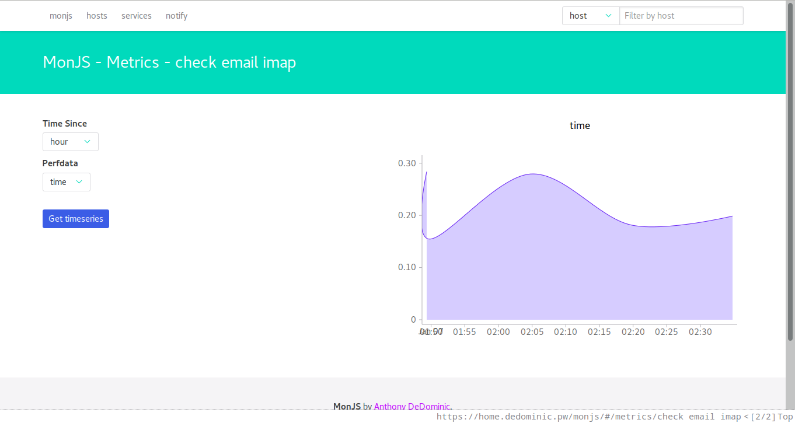

MonJS
=====

A monitoring wep application tool that leverages nagios-like tools and idioms.
Unlike nagios-core, this tool has a full-featured web ui to dynamically configure hosts and services.

init
----

    # will create the default configuration file.
    monjs init 

    # will start the application
    monjs start

    # launch into background
    monjs start > monjs.log & disown

Make sure to edit the configuration file before use; the init command will indicate where it was saved.

Using
-----

By default, the config has the program listen on port 9001.

When hitting the index page, you should be prompted for the api key, which was set in the config.

Hosts
-----

Hosts are just simple documents with an alias (hostname), an address (your.domain.tld or some ip) and extra variables (you can put extra information your services can use to check the health of your host).

    # example host
    # note that extra_vars should be lowercase only
    {
        "name": "alias",
        "address": "your.domain.tld",
        "extra_vars": {
            "service_pass": "some secret"        
        }
    }

Variables in a host can be accessed via the "args" of a service.
To access them, use \$VAR\$ or \$\_VAR\$ for extra_vars:

    $NAME$          - is replaced by the host's alias name
    $ADDRESS$       - is replaced by the address of the host
    $_SERVICE_PASS$ - gets the service_pass variable in extra_vars

Services
--------

Services should Ideally be nagios compatible commands.
Like hosts, they have an alias which is denoted by name.
A service must be associated with only one, sigular host (future versions may allow for grouping common hosts).
The service must also have a command; the command is just a path to an executable on the server or a command which can be found in monjs's configured process.env.PATH (see the config file).
Interval is the frequency, in miliseconds, the command is executed.

In the web ui, args is just a string which is automatically split into an array.
quoted strings will be converted to a singular argument.
As stated in the Hosts section, you can access host variables using the \$VAR\$ or \$\_VAR\$ syntax.

Limitations
-----------

All service changes will trigger a service to fire.
This includes changing service variables, renaming the service's host's name, etc.

Atom/RSS Feeds
--------------

Currently MonJS does not offer to push failure notifications and likely will not in the future.
In corporate Nagios deployments, I always use RSS feeds instead of emails or other active push services.
This way users can choose to listen to the alerts instead of filtering the emails to the trash if they don't care.

Screenshots
-----------

TODO
----

  * full-featured command line client.
  * logo?
